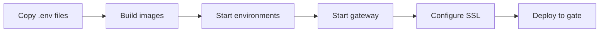

# Deployment Files Index

Complete index of all deployment files for the multi-environment setup.

## Quick Navigation

- **Local Development**: [`LOCAL_DEVELOPMENT.md`](./LOCAL_DEVELOPMENT.md) - Start here for local development
- **Getting Started**: [`QUICK_START.md`](./QUICK_START.md) - Deploy to gateway server
- **Full Documentation**: [`GATEWAY_SETUP.md`](./GATEWAY_SETUP.md) - Complete setup guide
- **Architecture**: [`ARCHITECTURE.md`](./ARCHITECTURE.md) - System architecture

## Docker Compose Files

### Environment Configurations
| File | Purpose | Location | Containers |
|------|---------|----------|-----------|
| [`docker-compose.local.yml`](./docker-compose.local.yml) | Local development | Your machine | app-local, postgres-local, redis-local, qdrant-local |
| [`docker-compose.dev.yml`](./docker-compose.dev.yml) | Development environment | Gate server | app-dev, postgres-dev, redis-dev, qdrant-dev, lexwebapp-dev |
| [`docker-compose.stage.yml`](./docker-compose.stage.yml) | Staging environment | Gate server | app-stage, postgres-stage, redis-stage, qdrant-stage, lexwebapp-stage |
| [`docker-compose.prod.yml`](./docker-compose.prod.yml) | Production environment | Gate server | app-prod, postgres-prod, redis-prod, qdrant-prod, lexwebapp-prod |
| [`docker-compose.gateway.yml`](./docker-compose.gateway.yml) | Nginx gateway proxy | Gate server | legal-nginx-gateway |

## Configuration Files

### Nginx Configuration
- [`nginx-gateway-3env.conf`](./nginx-gateway-3env.conf) - Routes traffic to all 3 environments

### Environment Variables (Templates)
- [`.env.local.example`](./.env.local.example) - Local development variables template (your machine)
- [`.env.dev.example`](./.env.dev.example) - Development environment variables template (gate server)
- [`.env.stage.example`](./.env.stage.example) - Staging environment variables template (gate server)
- [`.env.prod.example`](./.env.prod.example) - Production environment variables template (gate server)

**⚠️ Important**: Copy `.env.*.example` to `.env.*` and fill in real values before starting.

## Scripts

### Management Script
- [`manage-gateway.sh`](./manage-gateway.sh) - Main deployment management script

**Capabilities**:
- Start/stop/restart environments
- View status and logs
- Deploy to gate server
- Build Docker images
- Gateway management
- Health checks

**Usage**:
```bash
./manage-gateway.sh <command> [environment]
```

See `./manage-gateway.sh` (no arguments) for full help.

## Documentation

| Document | Description | Audience |
|----------|-------------|----------|
| [`LOCAL_DEVELOPMENT.md`](./LOCAL_DEVELOPMENT.md) | Local dev setup guide | Developers (START HERE!) |
| [`QUICK_START.md`](./QUICK_START.md) | Gateway deployment guide | DevOps/Deployment |
| [`GATEWAY_SETUP.md`](./GATEWAY_SETUP.md) | Complete setup guide | DevOps/Deployment |
| [`ARCHITECTURE.md`](./ARCHITECTURE.md) | Architecture details | Technical team |
| [`INDEX.md`](./INDEX.md) | This file - index of all files | Everyone |
| [`README.md`](./README.md) | Legacy docs (2-env) | Reference only |

## Deployment Workflow



### Step-by-Step

1. **Setup**: Copy and configure `.env.*.example` → `.env.*`
2. **Build**: Run `./manage-gateway.sh build`
3. **Start**: Run `./manage-gateway.sh start all`
4. **Gateway**: Run `./manage-gateway.sh gateway start`
5. **SSL**: Configure system nginx for SSL termination
6. **Deploy**: Run `./manage-gateway.sh deploy all`

## Port Reference

| Environment | Backend | Frontend | PostgreSQL | Redis | Qdrant |
|------------|---------|----------|------------|-------|---------|
| **Local** | **3000** | **5173** | **5432** | **6379** | **6333-6334** |
| Development | 3003 | 8091 | 5433 | 6380 | 6335-6336 |
| Staging | 3002 | 8092 | 5434 | 6381 | 6337-6338 |
| Production | 3001 | 8090 | 5432 | 6379 | 6333-6334 |
| **Gateway** | **8080** | - | - | - | - |

## URL Structure

```
http://localhost:3000                    → Local (your machine)
https://legal.org.ua/development/        → Development (gate server)
https://legal.org.ua/staging/            → Staging (gate server)
https://legal.org.ua/                    → Production (gate server)
```

## File Structure

```
deployment/
├── docker-compose.local.yml         # Local development (your machine)
├── docker-compose.dev.yml           # Development (gate server)
├── docker-compose.stage.yml         # Staging (gate server)
├── docker-compose.prod.yml          # Production (gate server)
├── docker-compose.gateway.yml       # Nginx gateway (gate server)
├── nginx-gateway-3env.conf          # Nginx routing config
├── .env.local.example               # Local env template
├── .env.dev.example                 # Development env template
├── .env.stage.example               # Staging env template
├── .env.prod.example                # Production env template
├── .env.local                       # ⚠️ Actual local env (gitignored)
├── .env.dev                         # ⚠️ Actual dev env (gitignored)
├── .env.stage                       # ⚠️ Actual stage env (gitignored)
├── .env.prod                        # ⚠️ Actual prod env (gitignored)
├── manage-gateway.sh                # Management script
├── LOCAL_DEVELOPMENT.md             # Local dev guide (START HERE!)
├── QUICK_START.md                   # Gateway deployment guide
├── GATEWAY_SETUP.md                 # Complete documentation
├── ARCHITECTURE.md                  # Architecture details
├── INDEX.md                         # This file
└── README.md                        # Legacy docs
```

## Environment Variables Required

Each `.env.*` file needs:

**Essential**:
- `POSTGRES_PASSWORD` - Database password
- `JWT_SECRET` - JWT signing secret (64 chars)
- `OPENAI_API_KEY` - OpenAI API key
- `ZAKONONLINE_API_TOKEN` - ZakonOnline token
- `SECONDARY_LAYER_KEYS` - API access keys

**OAuth**:
- `GOOGLE_CLIENT_ID`
- `GOOGLE_CLIENT_SECRET`
- `GOOGLE_CALLBACK_URL` (different per env)
- `FRONTEND_URL` (different per env)

**Optional**:
- `OPENAI_API_KEY2` - Fallback key
- `ZAKONONLINE_API_TOKEN2` - Fallback token
- `ANTHROPIC_API_KEY` - For Claude models
- `LLM_PROVIDER_STRATEGY` - Model selection strategy

## Common Commands

```bash
# Local development (your machine)
./manage-gateway.sh start local      # Start local environment
./manage-gateway.sh stop local       # Stop local environment
./manage-gateway.sh logs local       # View local logs

# Gateway environments (gate server)
./manage-gateway.sh start all        # Start all gateway envs (dev+stage+prod)
./manage-gateway.sh stop dev         # Stop specific environment
./manage-gateway.sh logs prod        # View production logs

# Management
./manage-gateway.sh status           # View status of all containers
./manage-gateway.sh health           # Check health of all services

# Deploy to gate server
./manage-gateway.sh deploy all       # Deploy all environments to gate

# Gateway operations (gate server)
./manage-gateway.sh gateway start    # Start nginx gateway
./manage-gateway.sh gateway restart  # Restart nginx gateway
./manage-gateway.sh gateway test     # Test nginx configuration
```

## Troubleshooting Quick Links

- **Health checks fail**: [`GATEWAY_SETUP.md#troubleshooting`](./GATEWAY_SETUP.md#troubleshooting)
- **Port conflicts**: [`GATEWAY_SETUP.md#port-conflicts`](./GATEWAY_SETUP.md#port-conflicts)
- **Database issues**: [`GATEWAY_SETUP.md#database-connection-issues`](./GATEWAY_SETUP.md#database-connection-issues)
- **Nginx errors**: [`GATEWAY_SETUP.md#nginx-configuration-issues`](./GATEWAY_SETUP.md#nginx-configuration-issues)

## Support

- **Documentation**: Start with `QUICK_START.md`, then `GATEWAY_SETUP.md`
- **Issues**: Check `GATEWAY_SETUP.md#troubleshooting`
- **Architecture**: See `ARCHITECTURE.md` for technical details

## Version History

| Version | Date | Changes |
|---------|------|---------|
| 1.1.0 | 2026-01-21 | Added local development environment |
| 1.0.0 | 2026-01-21 | Initial 3-environment gateway setup |

## Getting Started Checklist

**For Local Development** (developers):
- [ ] Read [`LOCAL_DEVELOPMENT.md`](./LOCAL_DEVELOPMENT.md)
- [ ] Copy `.env.local.example` to `.env.local`
- [ ] Add OpenAI and ZakonOnline API keys
- [ ] Run `./manage-gateway.sh start local`
- [ ] Access http://localhost:3000

**For Gateway Deployment** (DevOps):
- [ ] Read [`QUICK_START.md`](./QUICK_START.md)
- [ ] Copy all `.env.*.example` files (dev, stage, prod)
- [ ] Configure environment-specific values
- [ ] Run `./manage-gateway.sh build`
- [ ] Run `./manage-gateway.sh deploy all`

---

**Generated**: 2026-01-21
**Maintainer**: SecondLayer Team
